# # Production-Ready MERN Stack Deployment on AWS

<p align="left">

  

  

  

  

  

  

  

</p>

# Project Overview

The TravelMemory application is a full-stack MERN application deployed on AWS infrastructure using:

- EC2 Instances
- Nginx
- PM2
- Application Load Balancer (ALB)
- MongoDB Atlas
- Cloudflare

---

# Objective

The objective of this project was to:

- Deploy the MERN stack application on AWS EC2
- Configure backend and frontend services
- Enable frontend-backend communication
- Configure reverse proxy using Nginx
- Implement load balancing using AWS ALB
- Connect a custom domain using Cloudflare
- Create scalable and resilient architecture

---

# Technology Stack

| Component | Technology |
|---|---|
| Frontend | React.js |
| Backend | Node.js + Express.js |
| Database | MongoDB Atlas |
| Web Server | Nginx |
| Process Manager | PM2 |
| Cloud Platform | AWS EC2 |
| Load Balancer | AWS Application Load Balancer |
| DNS & SSL | Cloudflare |

---

# Architecture Overview

The deployment architecture consists of:

1. User requests routed through Cloudflare
2. Cloudflare forwards requests to AWS Application Load Balancer
3. ALB distributes traffic between two EC2 instances
4. Each EC2 instance runs:
   - React Frontend
   - Node.js Backend
   - Nginx Reverse Proxy
   - PM2 Process Manager
5. Backend communicates with MongoDB Atlas

---

# Deployment Architecture Diagram

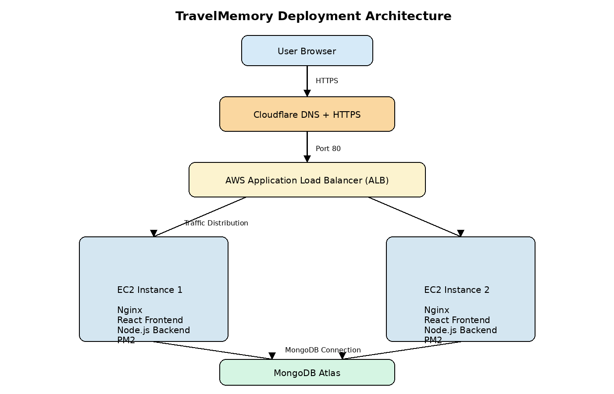

---

# Step 1 — Launch EC2 Instances

## Actions Performed

- Created Ubuntu EC2 instances
- Configured security groups
- Allowed inbound traffic for:
  - SSH (22)
  - HTTP (80)
  - HTTPS (443)
  - Custom TCP (3000 if required)

## Commands Used

```bash
ssh -i key.pem ubuntu@<EC2-Public-IP>
```

## Screenshots

### Project Repository

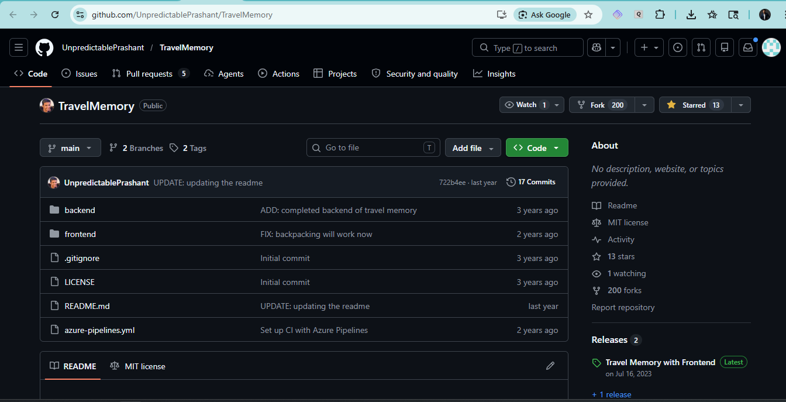

### EC2 Instances Running

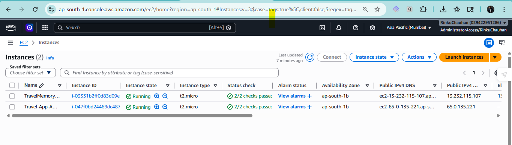

### Security Group Configuration

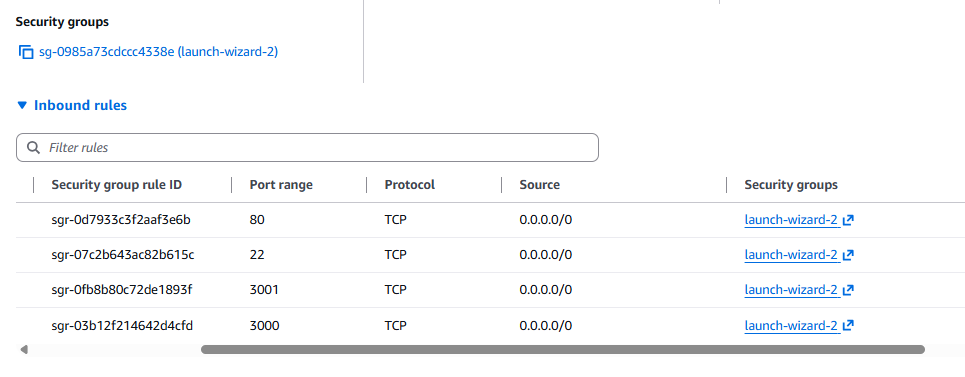

---

# Step 2 — SSH into EC2

## Screenshot

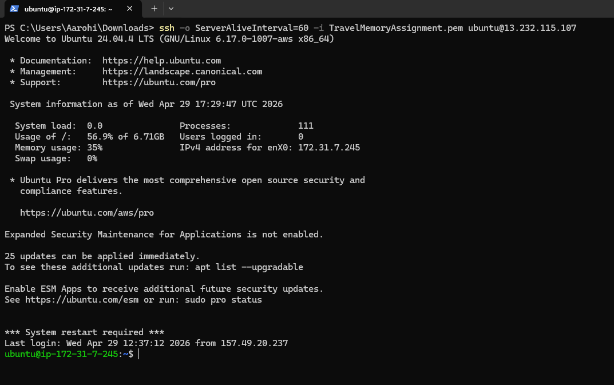

---

# Step 3 — Clone GitHub Repository

## Actions Performed

- Cloned TravelMemory repository into EC2 instance

## Commands Used

```bash
git clone https://github.com/UnpredictablePrashant/TravelMemory.git
```

## Screenshot

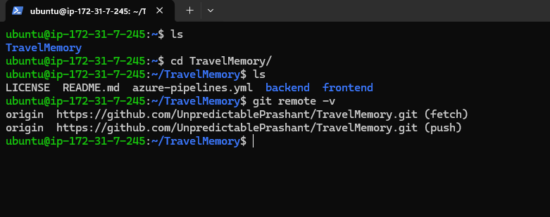

---

# Step 4 — Backend Configuration

## Actions Performed

- Navigated to backend directory
- Installed dependencies
- Configured environment variables
- Connected MongoDB Atlas
- Started backend using PM2

## Commands Used

```bash
cd TravelMemory/backend
npm install
```

## `.env` Configuration

```env
PORT=3000
MONGO_URI=<MongoDB Atlas Connection String>
```

## Start Backend Using PM2

```bash
pm2 start index.js --name backend
pm2 save
```

## Verification

```bash
pm2 list
curl http://localhost:3000/trip
```

## Screenshots

### Backend Environment Configuration

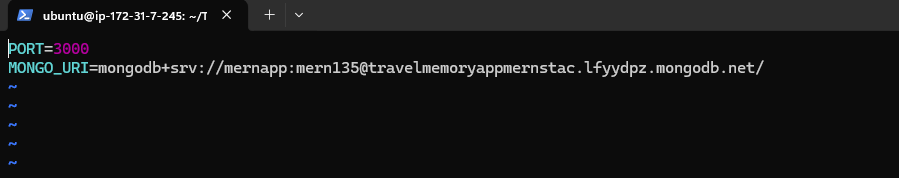

### PM2 Backend Running

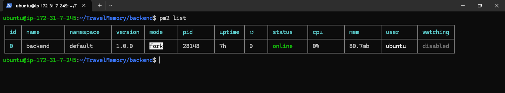

### Backend API Working

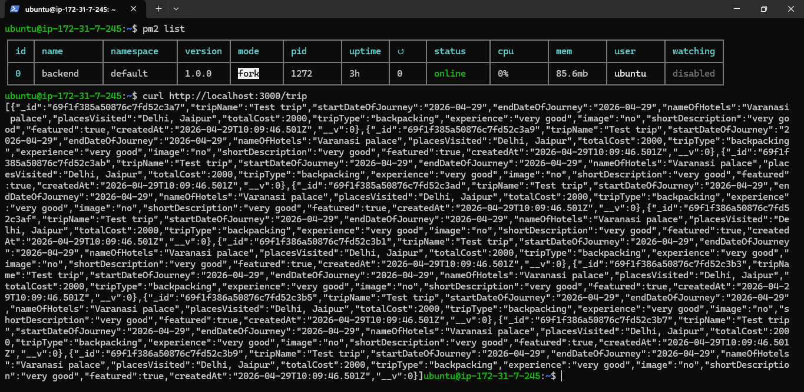

---

# Step 5 — NGINX Reverse Proxy Configuration

## Actions Performed

- Installed NGINX
- Configured reverse proxy
- Served React build
- Forwarded backend traffic to Node.js backend

## Commands Used

```bash
sudo apt install nginx -y
```

## NGINX Configuration

```nginx
server {
    listen 80;
    server_name _;

    root /home/ubuntu/TravelMemory/frontend/build;
    index index.html;

    location / {
        try_files $uri /index.html;
    }

    location /trip {
        proxy_pass http://localhost:3000;
    }
}
```

## Enable Site

```bash
sudo ln -s /etc/nginx/sites-available/travelmemory /etc/nginx/sites-enabled/

sudo nginx -t

sudo systemctl restart nginx
```

## Screenshot

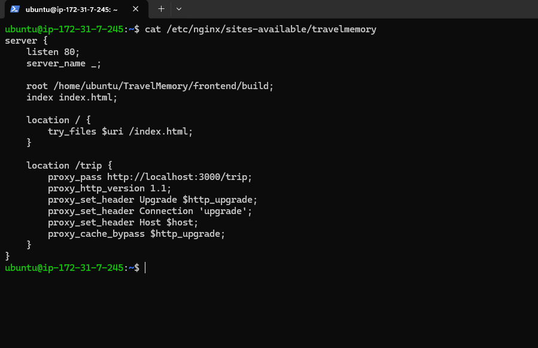

---

# Step 6 — Frontend Configuration

## Actions Performed

- Navigated to frontend directory
- Installed frontend dependencies
- Configured frontend backend URL
- Generated React production build

## Commands Used

```bash
cd ~/TravelMemory/frontend
npm install
```

## `url.js` Configuration

```javascript
export const baseUrl = window.location.origin;
```

## Build React Application

```bash
npm run build
```

## Screenshots

### Frontend Build Successful

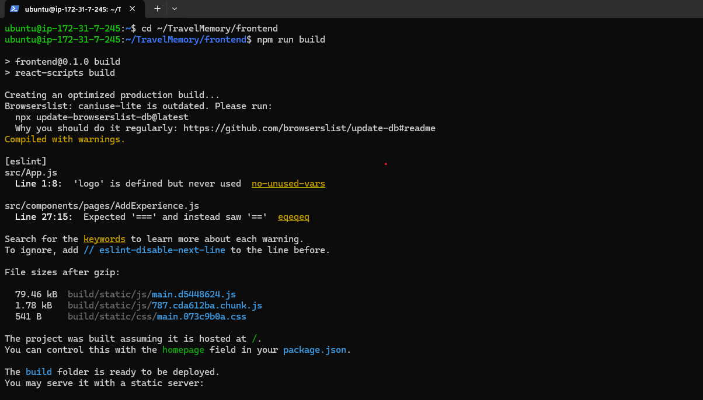

### Frontend URL Configuration

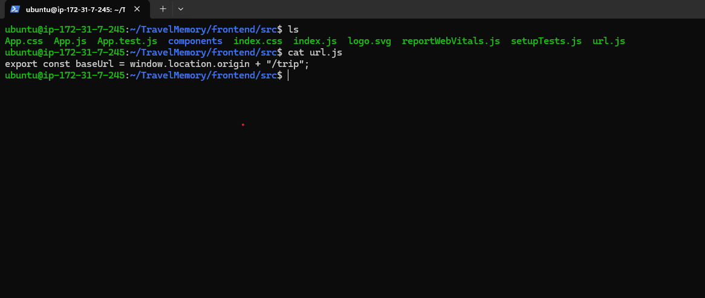

---

# Step 7 — Frontend and Backend Integration

## Actions Performed

- Verified frontend communication with backend
- Tested API integration
- Verified dynamic trip data rendering

## Verification

```bash
curl http://localhost/trip
```

## Screenshot

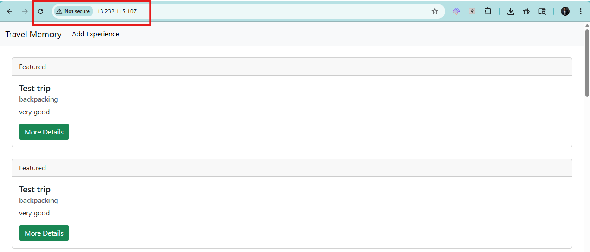

---

# Step 8 — Scaling the Application

## Actions Performed

- Created second EC2 instance
- Deployed same application on second server
- Configured AWS Application Load Balancer
- Registered both instances into target group

## AWS Components Used

- Target Group
- Application Load Balancer (ALB)
- Health Checks

## Screenshots

### Elastic IP

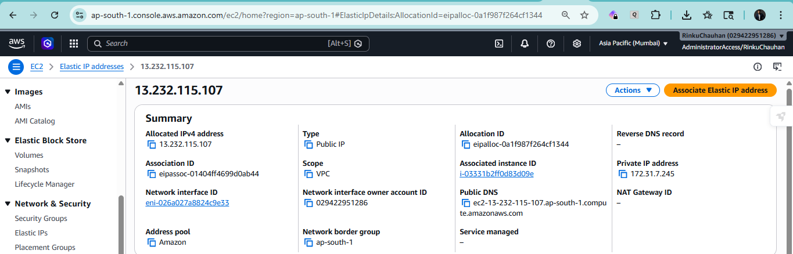

### Target Group Healthy Targets

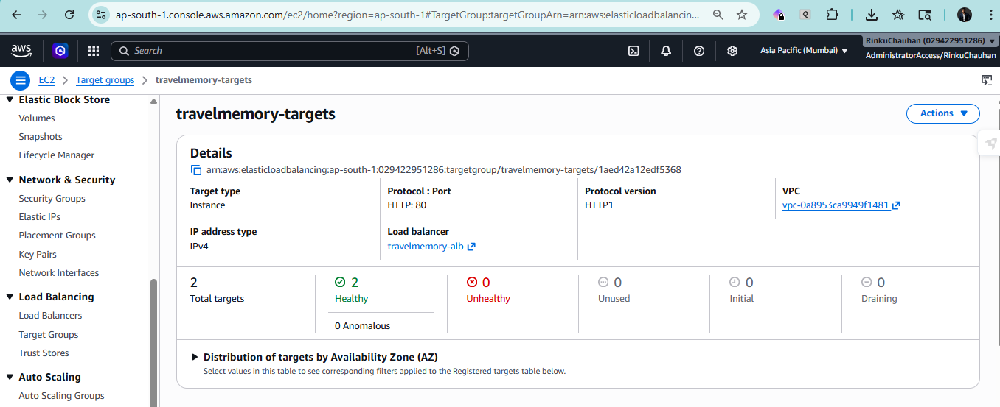

### ALB Active Status

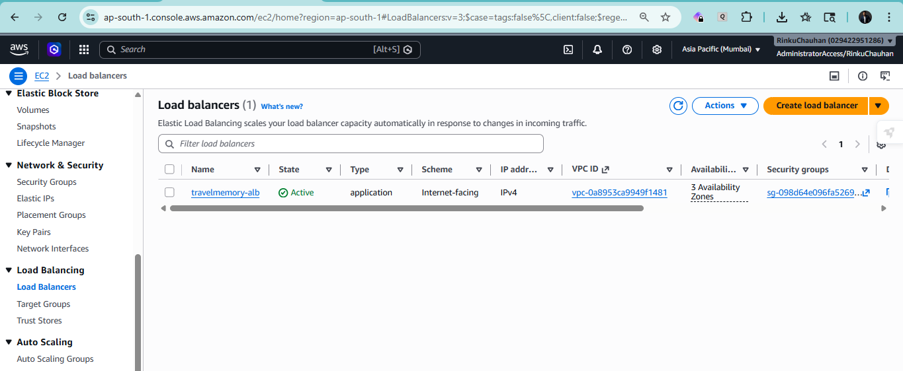

---

# Step 9 — Domain Setup Using Cloudflare

## Actions Performed

- Added domain to Cloudflare
- Updated Namecheap nameservers
- Configured DNS records
- Enabled HTTPS

## DNS Records

| Type | Name | Target |
|---|---|---|
| CNAME | @ | ALB DNS |
| CNAME | www | rinku-devops.site |
| A | frontend | EC2 Elastic IP |

---

# SSL Configuration

- SSL Mode: Flexible
- Always Use HTTPS: Enabled

## Screenshots

### Cloudflare DNS Records

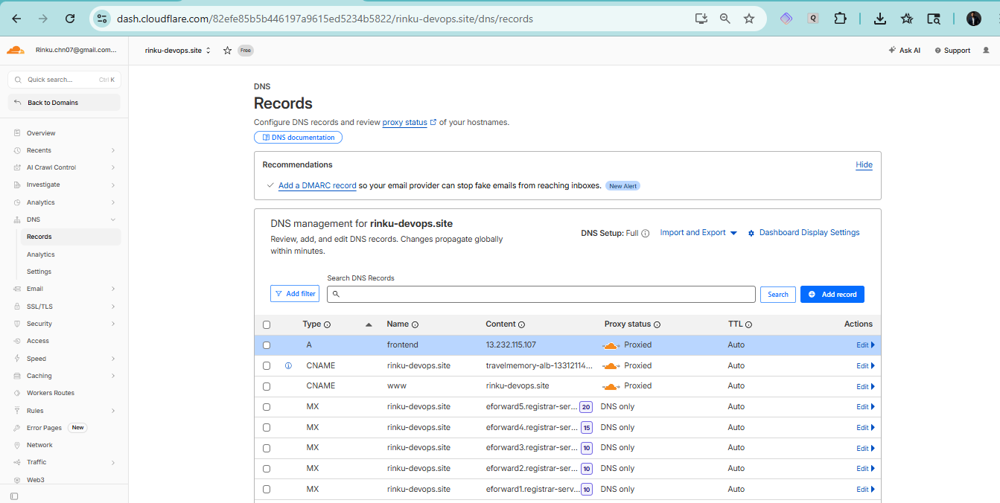

### Namecheap Nameserver

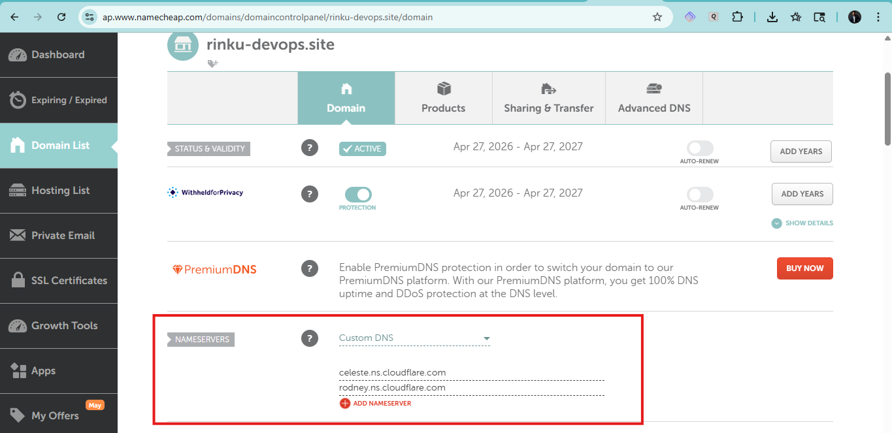

### ALB DNS Working

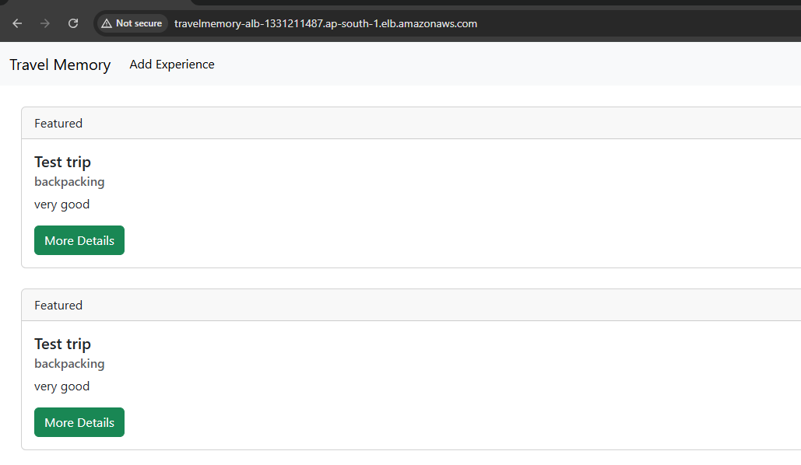

### Custom Domain and HTTPS Enabled

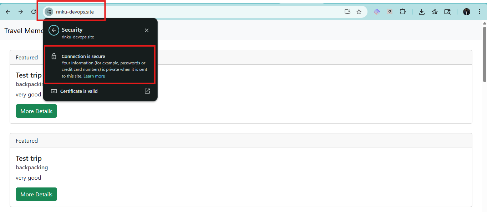

---

# 🌐 Final Application URLs

| Component | URL |
|---|---|
| Main Domain | https://rinku-devops.site |
| WWW Domain | https://www.rinku-devops.site |

---

# Challenges Faced and Resolutions

| Issue | Resolution |
|---|---|
| MongoDB authentication failure | Corrected MongoDB Atlas credentials |
| Backend not running on second EC2 | Started backend using PM2 |
| React API routing issue | Fixed frontend API URL configuration |
| NGINX proxy misconfiguration | Corrected proxy_pass configuration |
| Cloudflare SSL errors | Configured Flexible SSL mode |
| React map() errors | Fixed API endpoint duplication |

---

# Best Practices Implemented

- Reverse proxy using NGINX
- Process management using PM2
- Load balancing using AWS ALB
- HTTPS using Cloudflare
- Multiple EC2 instances for scalability
- MongoDB Atlas cloud database

---

# Conclusion

The TravelMemory application was successfully deployed on AWS using a scalable architecture.

The deployment includes:

- Multiple EC2 instances
- Application Load Balancer
- Cloudflare DNS integration
- NGINX reverse proxy
- PM2 process management
- MongoDB Atlas integration

The application is accessible through a custom domain with HTTPS enabled and supports scalable traffic distribution through AWS ALB.

---
# Thank You
